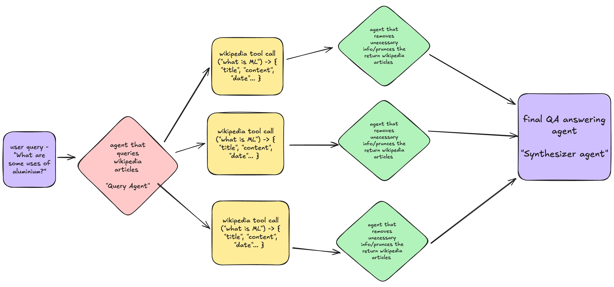

1. # Material QA

This project uses AI agents to answer questions based on provided materials.

## Setup

### Prerequisites

1. **Install `uv`**: Follow the instructions at [https://docs.astral.sh/uv/getting-started/installation/](https://docs.astral.sh/uv/getting-started/installation/) to install `uv`.
2. **Install Python 3.11**: Make sure you have Python 3.11 installed. You can use a tool like `pyenv` to manage Python versions.

### Installation

1. **Sync the environment and install dependencies**:

    ```bash
    uv sync
    ```

2. **Activate the virtual environment**:

    ```bash
    source .venv/bin/activate
    ```

## Running the Application

To run the main application:

```bash
uvicorn server:app --reload
```

### Environment Variables

This project requires an API key for Anthropic.

1. Create a `.env` file in the root of the project.
2. Add the following line to the `.env` file, replacing the placeholder with your actual API key:

```
ANTHROPIC_API_KEY="your_anthropic_api_key"
```

## Architecture


